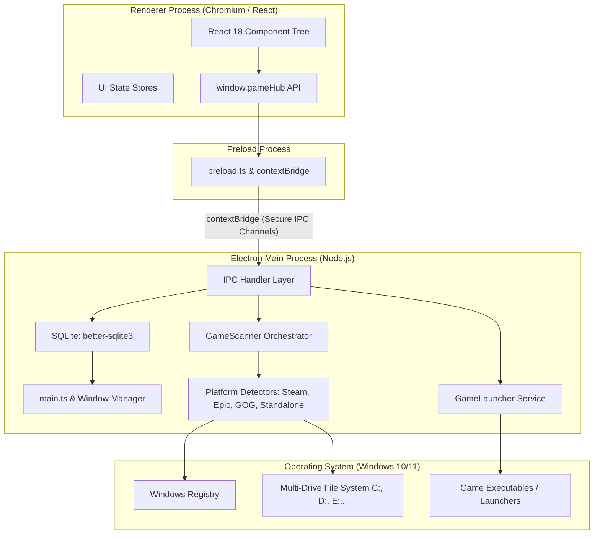
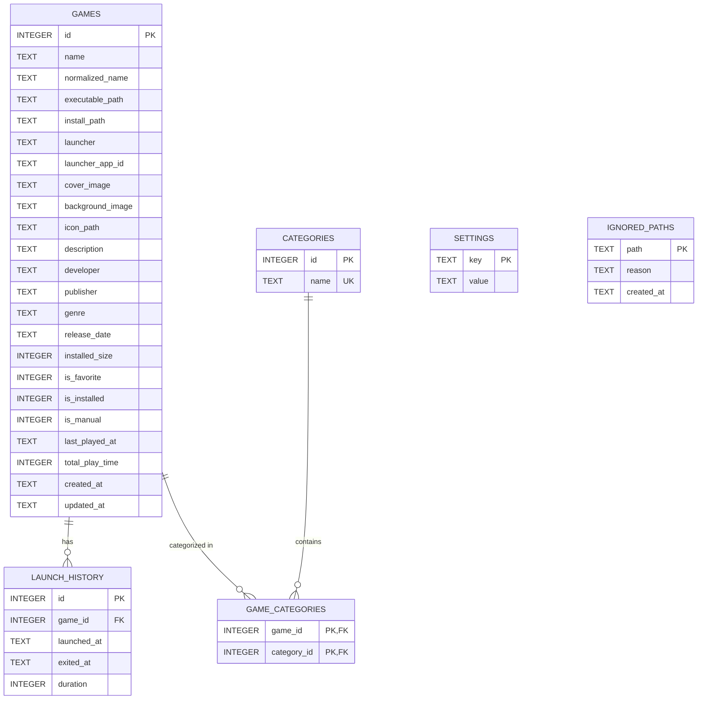

# GameHub — Architecture Design Document

## 1. System Overview

GameHub is a local-first personal PC game library and launcher for Windows. It provides an automated, non-intrusive game discovery engine paired with a modern desktop interface. It is architected to be modular, secure, high-performing, and resilient to disk and operating system changes.

---

## 2. Technology Stack & Environment

| Layer | Technology | Selection Rationale |
| :--- | :--- | :--- |
| **Runtime Container** | Electron (Node.js + Chromium) | Access to native Windows APIs, filesystem, process execution, and system tray while providing web-based UI rendering. |
| **Frontend Framework** | React (v18+) with TypeScript | Component-driven UI, strong typing, maintainability, and seamless state-to-view binding. |
| **Bundler & Tooling** | Vite & esbuild | Sub-second HMR during development and optimized production bundling for renderer and main processes. |
| **Styling** | Tailwind CSS + Modern CSS | Utility-first, high-performance styling with customized dark theme tokens and responsive grids. |
| **Database** | SQLite via `better-sqlite3` | Zero-latency, in-process synchronous/asynchronous disk-backed relational database with zero server configuration needed. |
| **Packaging** | electron-builder | Windows NSIS installer generation (`GameHub-Setup.exe`), auto-update compatibility, and asset signing. |

### Environment Verification (Phase 0)
- **Host OS**: Windows 10/11 x64
- **Node.js**: v24.16.0
- **npm**: v11.13.0 (`npm.cmd` invoked in PowerShell due to system execution policies)
- **Git**: v2.54.0.windows.1
- **Python**: v3.14.5

---

## 3. Process Architecture

Electron uses a multi-process architecture to isolate privileged system operations from UI rendering:



### 3.1 Main Process (`electron/main.ts`)
- Manages application lifecycle, window state (position, size, minimize-to-tray), and global shortcuts.
- Owns all privileged Node.js APIs (`fs`, `child_process`, `better-sqlite3`).
- Executes background game scanning and process monitoring without blocking UI renders.

### 3.2 Preload Process (`electron/preload.ts`)
- Bridges the Main and Renderer processes using Electron's `contextBridge.exposeInMainWorld`.
- Strictly enforces `nodeIntegration: false` and `contextIsolation: true`.
- Exposes typed methods on `window.gameHub` with parameter validation. Never leaks raw IPC or Node primitives.

### 3.3 Renderer Process (`src/`)
- Pure web environment (Chromium) running React and Tailwind CSS.
- Communicates exclusively through `window.gameHub`.
- State stores handle reactive UI updates (search query, selected filters, scanning status, active tab).

---

## 4. IPC Architecture

All communication between Renderer and Main follows a typed, request-response and event-push model.

### 4.1 Security Boundaries
- **No Direct Shell/FS Access**: The renderer cannot pass arbitrary shell commands or file paths to execute.
- **Strict Method Contracts**: Every IPC channel accepts strongly-typed arguments and performs validation in the main process before execution.

### 4.2 Exposed API Surface (`window.gameHub`)

```typescript
export interface IGameHubAPI {
  games: {
    getAll(): Promise<Game[]>;
    getById(id: number): Promise<Game | null>;
    add(game: Partial<Game>): Promise<Game>;
    update(id: number, updates: Partial<Game>): Promise<Game>;
    remove(id: number): Promise<boolean>;
    toggleFavorite(id: number): Promise<boolean>;
  };
  launcher: {
    launch(gameId: number): Promise<LaunchResult>;
    openFolder(gameId: number): Promise<boolean>;
  };
  scanner: {
    start(options?: ScanOptions): Promise<void>;
    cancel(): Promise<void>;
    onProgress(callback: (progress: ScanProgress) => void): () => void;
    onComplete(callback: (summary: ScanSummary) => void): () => void;
  };
  drives: {
    getAvailableDrives(): Promise<DriveInfo[]>;
  };
  settings: {
    getSettings(): Promise<AppSettings>;
    updateSettings(updates: Partial<AppSettings>): Promise<AppSettings>;
  };
}
```

---

## 5. Database Architecture

### 5.1 Storage Engine & File Location
- **Engine**: SQLite 3 via `better-sqlite3`.
- **Location**: `%APPDATA%/GameHub/gamehub.db`
- **Isolation**: Database is decoupled from application binaries, ensuring updates or reinstallation do not wipe user records.
- **WAL Mode**: Enabled (`PRAGMA journal_mode = WAL;`) for high concurrency and resilience.

### 5.2 Entity Relationship Diagram



---

## 6. Detection Architecture

### 6.1 Layered Detection Strategy
To eliminate false positives from system folders (e.g. `C:\Windows\System32`, `C:\Program Files\Common Files`), GameHub avoids indiscriminate disk-wide `.exe` crawling. Instead, it deploys a disciplined 5-layer detection pipeline:

```text
Layer 1: Known Launcher Configs & Registries (Steam, Epic, GOG, Xbox)
   ↓
Layer 2: App Manifests (appmanifest_*.acf, *.item manifests)
   ↓
Layer 3: Recognized Game Installation Trees (SteamLibrary, Epic Games, GOG Galaxy)
   ↓
Layer 4: Heuristic Standalone Detection (Configured game directories, engine signatures)
   ↓
Layer 5: Manual User Additions (+ Add Game modal)
```

### 6.2 Detector Interface
All platform detectors implement the unified `GameDetector` contract:

```typescript
export interface GameDetector {
  readonly name: string;
  readonly launcherType: GameLauncher;
  
  /** Checks if the launcher or its prerequisites are present on this system */
  canRun(): Promise<boolean>;
  
  /** Scans the specified drives/paths and yields candidate games */
  detect(drives: string[]): Promise<GameCandidate[]>;
}
```

### 6.3 Candidate Deduplication Priority
When multiple detectors find the same game on disk:
```text
Launcher App ID (100% certainty)
       >
Installation Path (normalized canonical path)
       >
Executable Path (normalized file path)
       >
Normalized Name (case/symbol-insensitive string match)
```

### 6.4 Standalone Confidence Scoring
- **Confidence ≥ 90%**: Automatically added to the Library.
- **50% ≤ Confidence < 90%**: Placed in "Possible Games" view for user confirmation.
- **Confidence < 50%**: Ignored.

---

## 7. Build & Packaging Architecture

### 7.1 Development Pipeline
- **Vite Dev Server**: Serves frontend at `http://localhost:5173` with Lightning CSS and React HMR.
- **Electron Watcher**: Compiles TypeScript files under `electron/` using `esbuild` or `tsc` and spawns the Electron instance pointing to the Vite dev server URL.

### 7.2 Production Build Pipeline
1. **Renderer Build**: Vite compiles React components, CSS, and assets into `dist/`.
2. **Main/Preload Compilation**: Bundles `electron/main.ts` and `electron/preload.ts` into `dist-electron/`.
3. **Packaging**: `electron-builder` packages the runtime, assets, and compiled code into a standalone NSIS installer (`GameHub-Setup.exe`) configured in `electron-builder.yml`.

---

## 8. Development Phases Roadmap

Development progresses in strict phase order as specified in `PHASES.md`:
- **Phase 0**: Project Analysis & Planning *(Completed)*
- **Phase 1**: Desktop Application Shell
- **Phase 2**: Application UI Shell
- **Phase 3**: SQLite Database
- **Phase 4**: Electron IPC Architecture
- **Phase 5-40**: Scanner Modules, Launch Engines, UI Polish, & Production Release
